# 🚀 Workshop Setup Guide

> **Complete this setup BEFORE the workshop begins** to ensure you're ready to code!

---

## 📋 What You'll Need

- A computer with **Docker** installed - [Mac Download](https://docs.docker.com/desktop/setup/install/mac-install/) | [Windows Download](https://docs.docker.com/desktop/setup/install/windows-install/)
- A **Google account** (Gmail works fine)
- A **code editor** (I'm using VS Code)
- About **15 minutes** to complete setup
- Recommended extensions for VS Code:
  - Docker
  - Python
  - Pylance
  - Prettier - Code formatter
  - [Gemini Code Assist](https://marketplace.visualstudio.com/items?itemName=Google.geminicodeassist) 
---

## Step 1: Get Your Google Cloud Trial Account

Google has provided trial credits for this workshop!

### 1.1 Access Google Cloud

👉 **Visit**: https://<instructor-provided-url>

You will need to have an existing Google account - preferably a personal account - to sign up. GC might require that you have 2 factor Authentication (2FA) enabled.

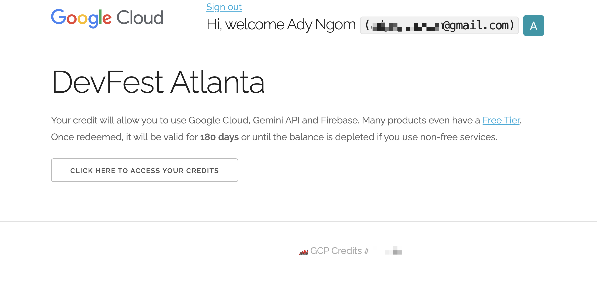

### 1.2 Accept the terms


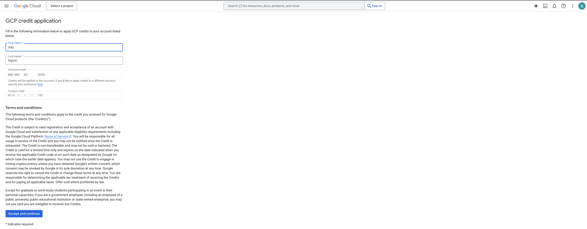

### 1.3 Credit Success

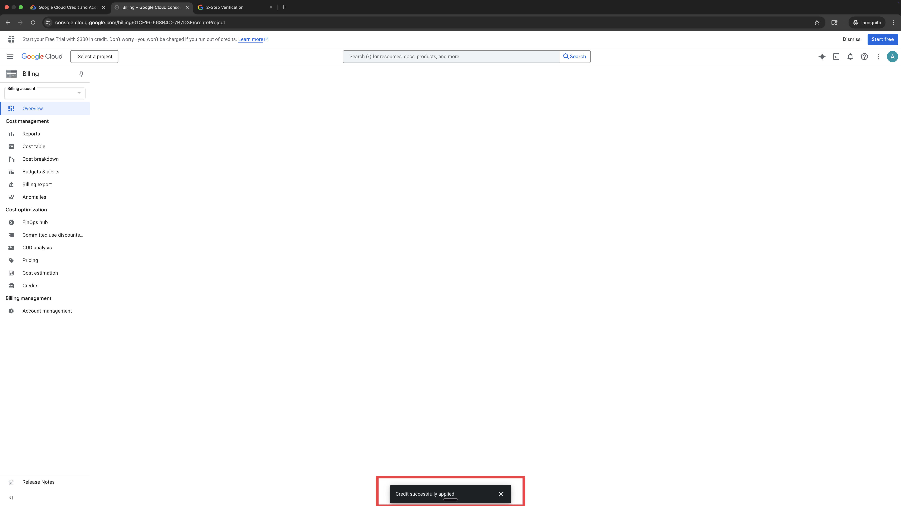

✅ **Success!** You now have access to Google Cloud Platform with trial credits.

---

## Step 2: Create A New Google Cloud Project

Now let's create a project for the workshop. Click on "Select Project" which opens a modal window and then click on "New Project" in the top right corner.

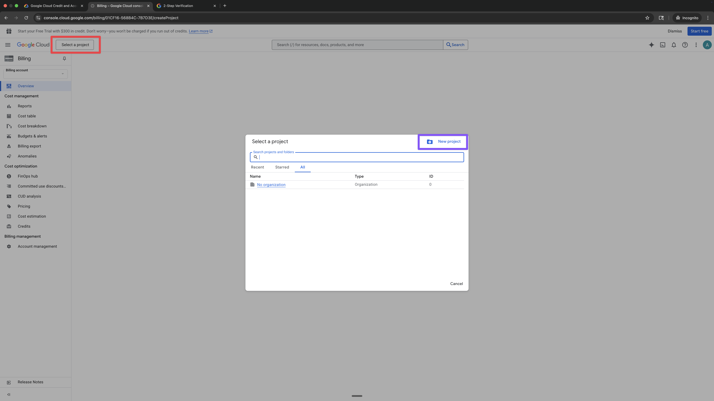

You won't be able to change the project name after creating, so make sure you give it a descriptive name like "Atlanta DevFest 2025" then click on the "Create" button.

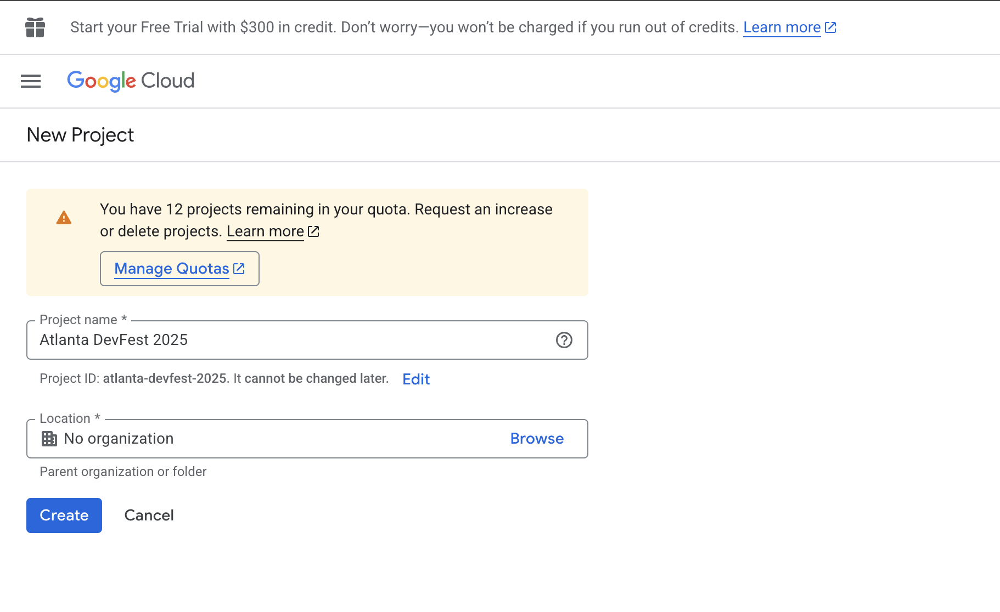

---

## Step 3: Set UP Your Project Credentials

Click on the navigation menu and go to "APIs & Services" > "OAuth consent screen".

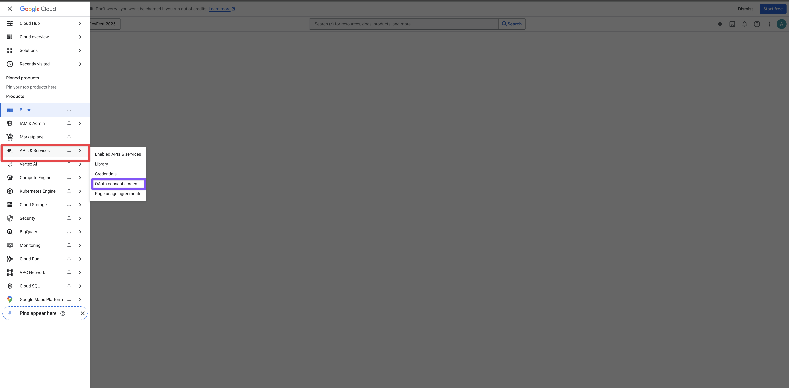

### 3.1 App Information
Fill out the app information with the app title and a support email.

### 3.2 Audience
Select "External" 

### 3.3 Contact Information
Add your email address in the contact information section. Optionally add more emails.

### 3.4 Policy
Agree to the User Data Policy and click on "Create".

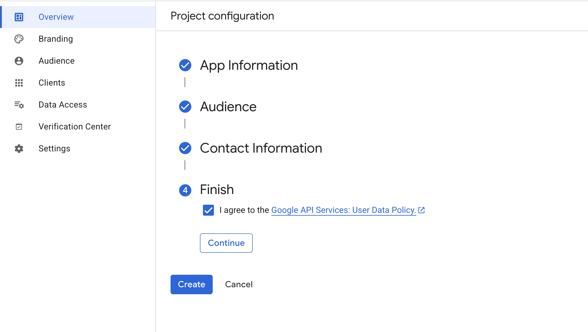

### 3.5 Setup OAuth Client

Now you need to create an OAuth client which is how you will mainly authenticate your cloud project.

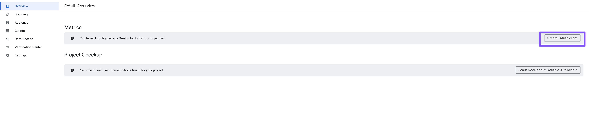

#### 3.5.1 Application Type

Choose "Web application" as the application type.

#### 3.5.2 Name Your Client

Give your client a name - I went for a slug version of the project name "atlanta-devfest-25-adk-workshop".

#### 3.5.3 Authorized URLs

For this workshop we will skip those but this is where you would add your authorized JavaScript origins and redirect URIs.

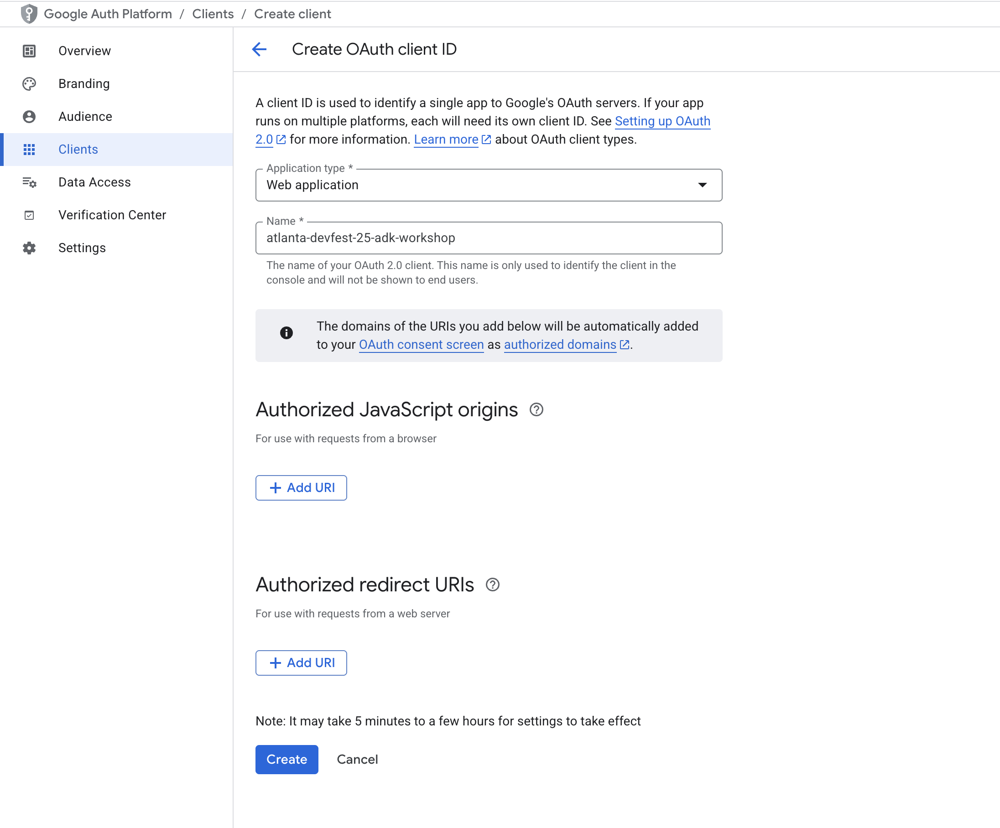

You should now see the success modal showing your Client ID and Client Secret. We will only need the Client ID for this workshop.

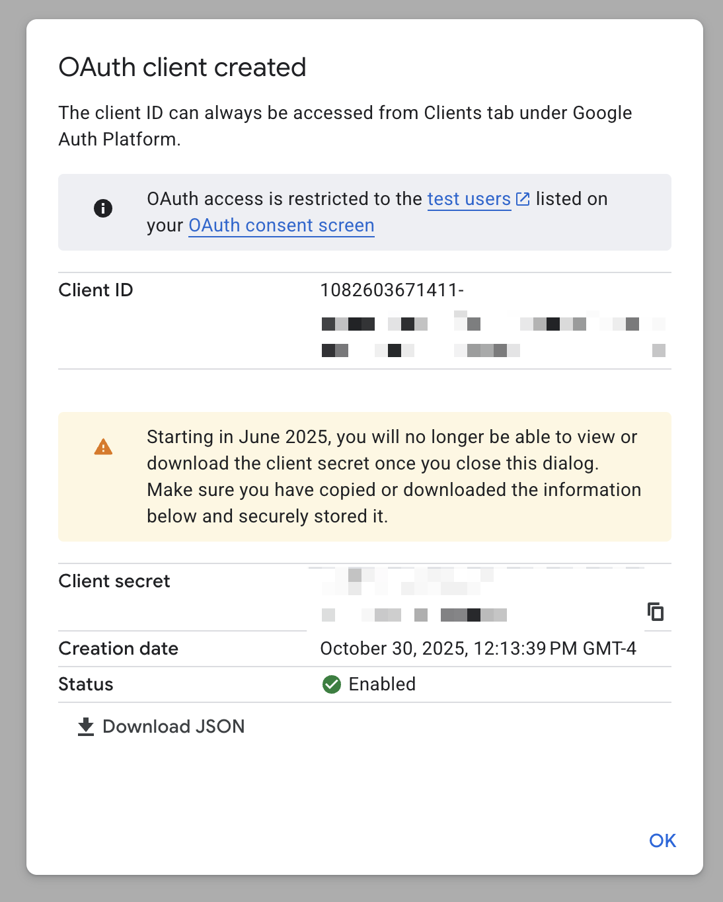

You can always come back to this page to get your Client ID or Client Secret when needed or you can also use the download button and save the info to your computer, just make sure to keep it safe.

## Step 4: Create Your Gemini API Key

Now let's get your API key to access the Gemini AI model.

### 4.1 Open Google AI Studio

👉 **Visit**: https://aistudio.google.com/apikey

You'll be asked to sign in with the same Google account. if this is the first time and you have never created a project before, you'll see a welcome screen and you can click on the "Import Project" button to proceed.

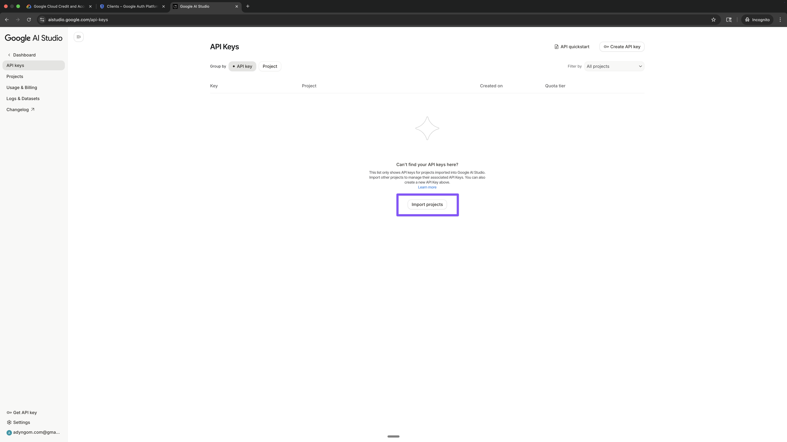

You can select all or just the one you have

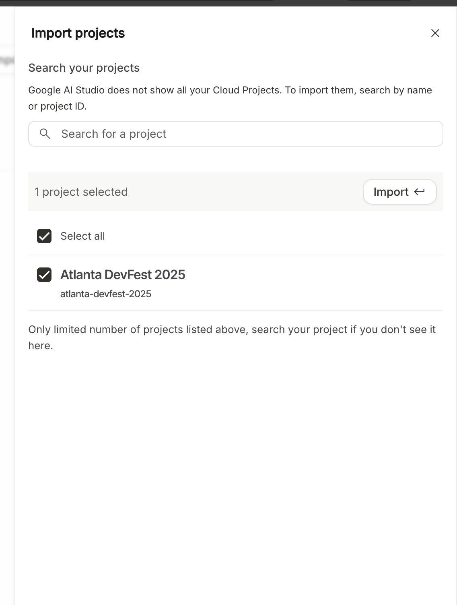

### 4.2 Create API Key

1. Navigate to the "API Keys" Page

2. Click the **"Create API key"** button on the top right

3. You'll see a dialog with two fields:
   - **"The name you want for your key"** ← apply any convention with a descriptive name
   - **"Pick a project to associate with the key"** ← your current Google Cloud project

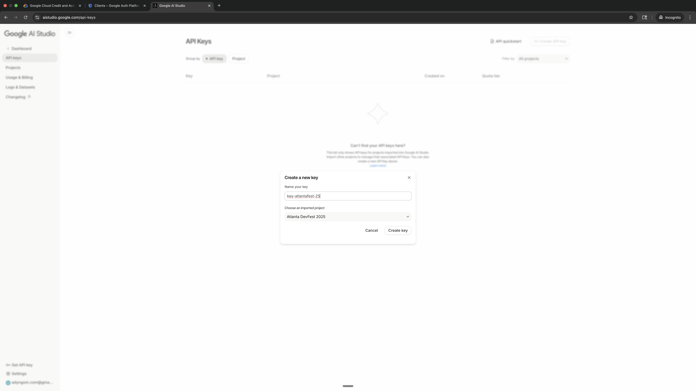   

3. Click **"Create key"**

4. Your API key will be generated instantly! ✨

### 4.3 Copy Your API Key

You will see a new entry on your API Keys list with the name you provided and the key itself hidden.

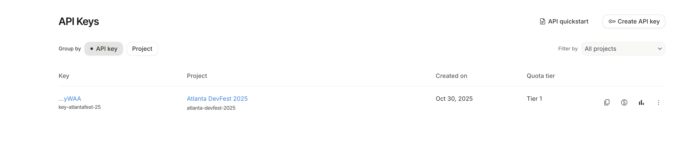

1. **Copy the entire key** - Click on the key link to open a modal with the key details, then copy the key string which usually looks like this:
   ```
   AIzaSyC_xxxxxxxxxxxxxxxxxxxxxxxxxxxxxxxx
   ```

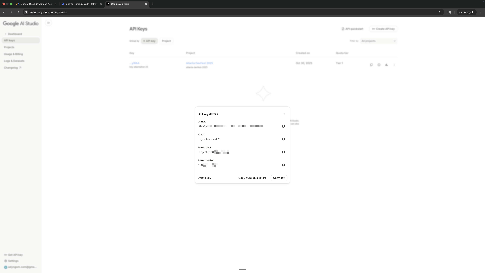

2. **Store it safely** - You'll need this in the next step

3. ⚠️ **Security Note**:
   - Never share this key publicly
   - Never commit it to GitHub
   - Treat it like a password

---

**[continue to project setup document](./0-B-SETUP-GUIDE-PROJECT.md)**
